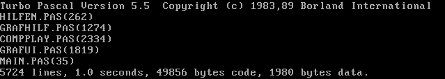
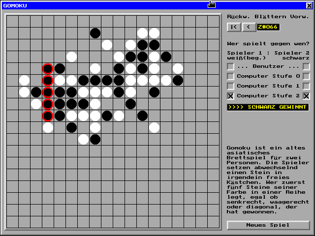

# Gomoku bzw. "Fünf in einer Reihe" in Turbo Pascal 5.5 & DOSBox-X (in German)

### Gomoku

Gomoku oder "Fünf in einer Reihe" ist ein altes asiatisches Brettspiel für zwei Personen. Die Spieler setzen abwechselnd einen Stein in irgendein freies Feld. Wer zuerst fünf Steine seiner Farbe in einer Reihe legt, egal ob senkrecht, waagerecht oder diagonal, der hat gewonnen.

[Mehr in Deutsch...](https://de.wikipedia.org/wiki/F%C3%BCnf_in_eine_Reihe) / [More in English](https://en.wikipedia.org/wiki/Gomoku)...

----

### Hinweise zum Kompilieren und zum Aufruf des Programms

Die Kompilierung und der Start des Programms kann heutzutage einfach in einer DOS-Box erfolgen; am besten mit dem Programm **[→ DOSBox-X](https://dosbox-x.com/)**.

Das Programm besteht aus den folgenden fünf Pascal-Dateien:

- Hauptprogramm: MAIN.PAS

- und den vier Pascal-Units: GRAFHILF.PAS, GRAFUI.PAS, HILFEN.PAS und COMPPLAY.PAS.

Hinweis: der Quellcode ist kodiert im Zeichensatz [IBM850 oder DOS-Latin-1](https://de.wikipedia.org/wiki/Codepage_850) mit DOS-/Windows-Zeilenenden  (0D+0A).

Unter der Annahme, daß sich der **[→ Turbo-Pascal-5.5-Compiler](https://www.pcjs.org/software/pcx86/lang/borland/pascal/5.50/)** im üblichen Verzeichnis **C:\TP** befindet, erfolgt die Compilierung mit dem DOS-Kommando:

- **C:\TP\TPC.EXE /B MAIN.PAS**

Das obige Kommando muß in dem Verzeichnis, in dem sich das Hauptprogramm MAIN.PAS und die Units befinden, ausgeführt werden.

Der Compiler gibt folgende Meldungen aus:

Die kompilierten Units *.TPU und das ausführbare Programm MAIN.EXE werden in das gleiche Verzeichnis
geschrieben.

Das Programm besitzt eine graphische Benutzeroberfläche (640x480 VGA-Graphik mit 16 Farben, unter Windows nur im DOS-Vollbildmodus läuffahig), die nur mit Hilfe einer Maus bedienbar ist. Eine Tastaturbedienung ist nicht vorgesehen.

Der VGA-Treiber **EGAVGA.BGI** muß im Aufrufverzeichnis oder im Verzeichnis C:\TP\GRAPHICS vorhanden sein.

Die Ausführung erfolgt durch das Kommando:

- **MAIN.EXE**

Es gibt zwei Aufrufparameter, die optional hinter das Kommando MAIN.EXE gesetzt werden können:

- **/U** ...- Das Unentschieden-Kriterium wird von "Brett voll" (kein /U angegeben) auf "keine Möglichkeit mehr
zum Sieg" (/U angegeben) umgeschaltet.

- **/D** ... Die Datenstruktur mit allen Spieldaten wird zu Beginn, nach jedem Zug und nach jeder
Zugrücknahme in eine Datei DEBUG.TXT geschrieben. Falls diese Datei beim Aufruf mit /D existiert,
wird diese Datei gelöscht und neu angelegt. Hinweis: Diese Datei kann nach längeren Spielen sehr
groß werden!

Im Normalfall brauchen die Parameter nicht gesetzt werden.

Das Programm wurde von mir im Rahmen des Programmierpraktikums im Sommersemester 2002 an der Fernuniversität Hagen (Lehrgebiet Praktische Informatik VI) erstellt und als eine der besten vier Lösungen prämiert.

----

### Sicherheitshinweis / Security Notice

Der von mir hier als gemeinfrei (Public Domain) veröffentlichte Code kann in Projekten Dritter verwendet werden. Ich pflege diese Projekte nicht, unterstütze sie nicht und stehe in keiner Verbindung zu ihnen. Jegliche böswillige oder irreführende Nutzung ist unzulässig und sollte gemeldet werden.

The code I released here into the public domain may appear in third-party projects. I do not maintain, endorse, or have any affiliation with such projects. Any malicious or deceptive use is unauthorized and should be reported.

----